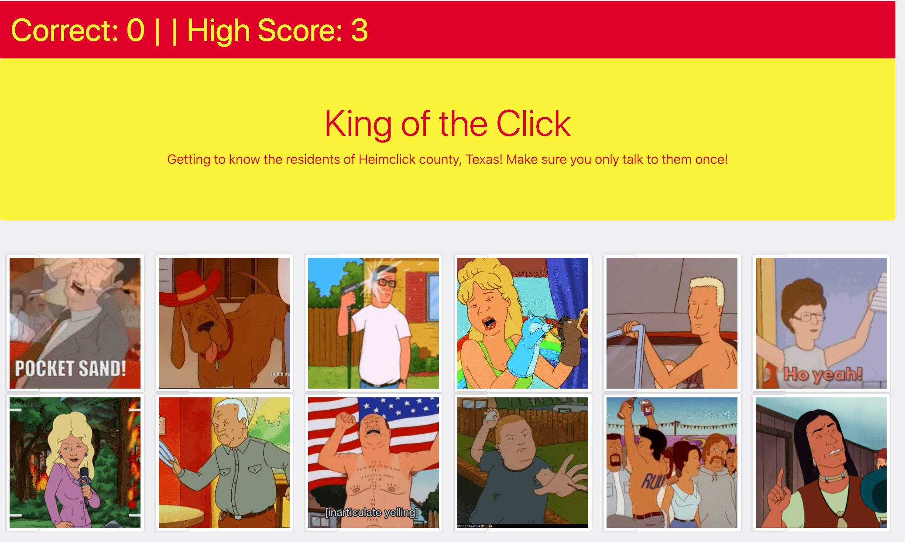

# King of the Click




## Deployment

[deployment](https://jenryhennifer.github.io/clickyGame/)

## Tech Used

* React
* JavaScript
* HTML
* CSS
* GitHub

## Description

The purpose of this project was to create a memory game using react. An App.Js file is uesed to handle the JSX rendering. This file imports the necessary JS files to be referenced when producing the HTML. The props are added into the JSX element to ensure they can be referenced properly in the components.

```
          <CharacterCard
            id={character.id}
            key={character.id}
            name={character.name}
            image={character.image}
            clicked={character.clicked}
            clickCharacter={this.clickCharacter}
          />
```

The state was also established inside of this file:

```
  state = {
    characters: characters,
    score: 0,
    highScore: 0,
  };
```
Whenever the image is clicked it will process the ID of the image and produce the function called clickCaracter to handle the various functions within it.

```
    <div onClick={() => props.clickCharacter(props.id)} className="card col-6-md">
        <div className="img-thumbnail w-25" id={props.id}>
          
        </div>
    </div>
```
Whenever the state is changed, the page will re-render in order to include the updated state. The images were shuffled using a function which shuffled the array of objects; this would change the index of the object in the aray at a random location:

```
    const shuffleCharacters = (char) => {
      //shallow copy of the array
      //you do not ever want to modify the state directly
      const copy = char.concat();
      return copy.sort(() => Math.random() - 0.5);
    };
```
If an image is clicked for a second time, a functino called resetClick would be called which would reset all the clicked keys to 'false:

```
    const resetClick = (list) =>
      list.map((current) => ({
        ...current,
        clicked: false,
      }));
```

<hr>

## License

MIT License

Copyright (c) 2020 Jennifer Henry

Permission is hereby granted, free of charge, to any person obtaining a copy of this software and associated documentation files (the "Software"), to deal in the Software without restriction, including without limitation the rights to use, copy, modify, merge, publish, distribute, sublicense, and/or sell copies of the Software, and to permit persons to whom the Software is furnished to do so, subject to the following conditions:

The above copyright notice and this permission notice shall be included in all copies or substantial portions of the Software.

THE SOFTWARE IS PROVIDED "AS IS", WITHOUT WARRANTY OF ANY KIND, EXPRESS OR IMPLIED, INCLUDING BUT NOT LIMITED TO THE WARRANTIES OF MERCHANTABILITY, FITNESS FOR A PARTICULAR PURPOSE AND NONINFRINGEMENT. IN NO EVENT SHALL THE AUTHORS OR COPYRIGHT HOLDERS BE LIABLE FOR ANY CLAIM, DAMAGES OR OTHER LIABILITY, WHETHER IN AN ACTION OF CONTRACT, TORT OR OTHERWISE, ARISING FROM, OUT OF OR IN CONNECTION WITH THE SOFTWARE OR THE USE OR OTHER DEALINGS IN THE SOFTWARE.


<hr />
<hr />

# Author

Jennifer Henry

* [LinkedIn](https://www.linkedin.com/in/jennifer-henry-4a540a149/)
* [GitHub](https://github.com/jenryhennifer)
* jenhenry1995@gmail.com